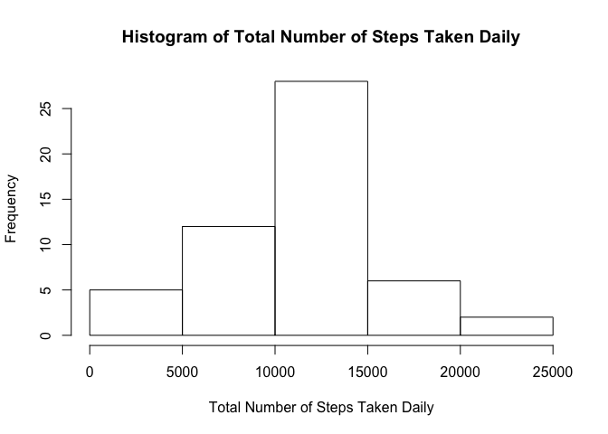
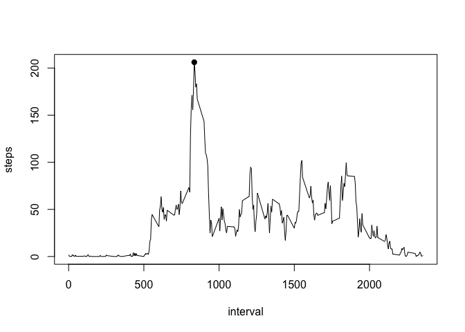
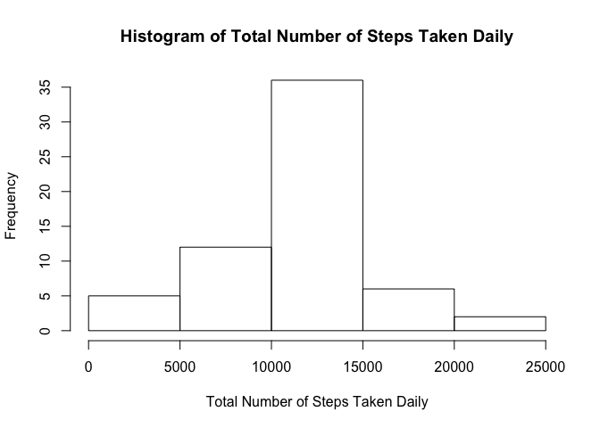
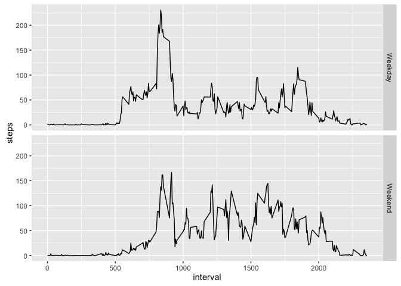

# Reproducible Research: Peer Assessment 1

## Loading and preprocessing the data

```r
if (!file.exists("activity.csv")) {
    
    if (!file.exists("activity.zip")) {
        stop("File 'activity.zip' not found!")
    }
    
    unzip("activity.zip")
    
    if (!file.exists("activity.csv")) {
        stop("File 'activity.csv' not found!")
    }
}

activity <- read.csv("activity.csv", na.strings = "NA", stringsAsFactors = FALSE)
daily.steps <- aggregate(steps ~ date, activity, sum)
daily.steps <- daily.steps[order(daily.steps$date),]
```

## What is mean total number of steps taken per day?

The table shown below summarises the dataset to the total number of steps taken per day.

```r
print(daily.steps)
```

```
##          date steps
## 1  2012-10-02   126
## 2  2012-10-03 11352
## 3  2012-10-04 12116
## 4  2012-10-05 13294
## 5  2012-10-06 15420
## 6  2012-10-07 11015
## 7  2012-10-09 12811
## 8  2012-10-10  9900
## 9  2012-10-11 10304
## 10 2012-10-12 17382
## 11 2012-10-13 12426
## 12 2012-10-14 15098
## 13 2012-10-15 10139
## 14 2012-10-16 15084
## 15 2012-10-17 13452
## 16 2012-10-18 10056
## 17 2012-10-19 11829
## 18 2012-10-20 10395
## 19 2012-10-21  8821
## 20 2012-10-22 13460
## 21 2012-10-23  8918
## 22 2012-10-24  8355
## 23 2012-10-25  2492
## 24 2012-10-26  6778
## 25 2012-10-27 10119
## 26 2012-10-28 11458
## 27 2012-10-29  5018
## 28 2012-10-30  9819
## 29 2012-10-31 15414
## 30 2012-11-02 10600
## 31 2012-11-03 10571
## 32 2012-11-05 10439
## 33 2012-11-06  8334
## 34 2012-11-07 12883
## 35 2012-11-08  3219
## 36 2012-11-11 12608
## 37 2012-11-12 10765
## 38 2012-11-13  7336
## 39 2012-11-15    41
## 40 2012-11-16  5441
## 41 2012-11-17 14339
## 42 2012-11-18 15110
## 43 2012-11-19  8841
## 44 2012-11-20  4472
## 45 2012-11-21 12787
## 46 2012-11-22 20427
## 47 2012-11-23 21194
## 48 2012-11-24 14478
## 49 2012-11-25 11834
## 50 2012-11-26 11162
## 51 2012-11-27 13646
## 52 2012-11-28 10183
## 53 2012-11-29  7047
```

The graph below is a histogram of the total number of steps taken daily.

```r
x.label <- "Total Number of Steps Taken Daily"
main.title <- paste("Histogram of", x.label)
with(daily.steps, hist(x = steps, xlab = x.label, main = main.title))
```



The mean of the total number of steps taken per day.

```r
mean(daily.steps$step)
```

```
## [1] 10766.19
```

The median of the total number of steps taken per day.

```r
median(daily.steps$step)
```

```
## [1] 10765
```

## What is the average daily activity pattern?

The graph below shows the 5-minute interval (x-axis) and the average number of steps taken, averaged across all days (y-axis).

```r
avg.steps.interval <- aggregate(steps ~ interval, activity, mean)
avg.steps.interval <- avg.steps.interval[order(avg.steps.interval$interval),]
with(avg.steps.interval, plot(interval, steps, type = "l"))
max.interval <- subset(avg.steps.interval, steps == max(avg.steps.interval$steps))
with(max.interval, points(interval, steps, pch = 19))
```



On average across all the days in the dataset, the 5-minute interval contains the maximum number of steps is:

```r
print(max.interval)
```

```
##     interval    steps
## 104      835 206.1698
```

## Imputing missing values

Total number of missing values in the dataset.

```r
sum(is.na(activity$steps))
```

```
## [1] 2304
```

Missing values are replaced with mean steps with respect to its 5-minute interval.

```r
new.activity <- activity
for (i in 1:nrow(activity)) {
    if (is.na(activity$steps[i])) {
        pos <- which(avg.steps.interval$interval == activity$interval[i])
        new.activity$steps[i] <-avg.steps.interval$steps[pos]
    }
}
```

The graph below is a histogram of the total number of steps taken daily after imputing missing values.

```r
new.daily.steps <- aggregate(steps ~ date, new.activity, sum)
new.daily.steps <- new.daily.steps[order(new.daily.steps$date),]
x.label <- "Total Number of Steps Taken Daily"
main.title <- paste("Histogram of", x.label)
with(new.daily.steps, hist(x = steps, xlab = x.label, main = main.title))
```



The mean of the total number of steps taken per day after imputing missing values.

```r
mean(new.daily.steps$step)
```

```
## [1] 10766.19
```

The median of the total number of steps taken per day after imputing missing values.

```r
median(new.daily.steps$step)
```

```
## [1] 10766.19
```

## Are there differences in activity patterns between weekdays and weekends?


```r
library(ggplot2)
```

```
## Warning: package 'ggplot2' was built under R version 3.2.3
```

```r
new.activity.weekdays <-weekdays(as.Date(new.activity$date, "%Y-%m-%d"), abbreviate = TRUE)
new.activity.weekdays[new.activity.weekdays == "Sat" | new.activity.weekdays == "Sun"] <- "Weekend"
new.activity.weekdays[new.activity.weekdays != "Weekend"] <- "Weekday"
new.activity.weekdays <- as.factor(new.activity.weekdays)
new.activity <- cbind(new.activity, new.activity.weekdays)
avg.steps.weekdays <- aggregate(steps ~ interval + new.activity.weekdays, data = new.activity, mean)
qplot(interval, steps, data = avg.steps.weekdays, geom = "line", facets = new.activity.weekdays ~ .)
```




